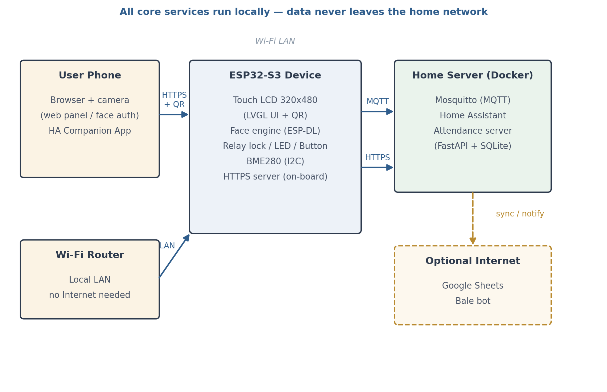
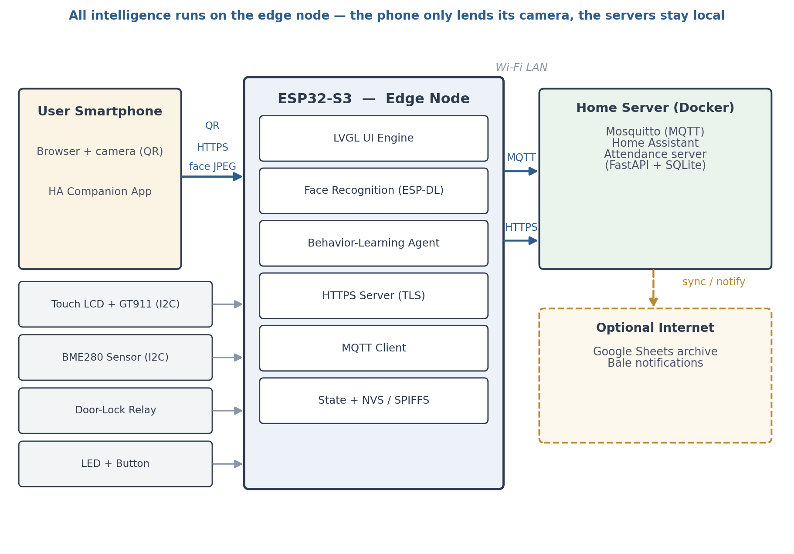
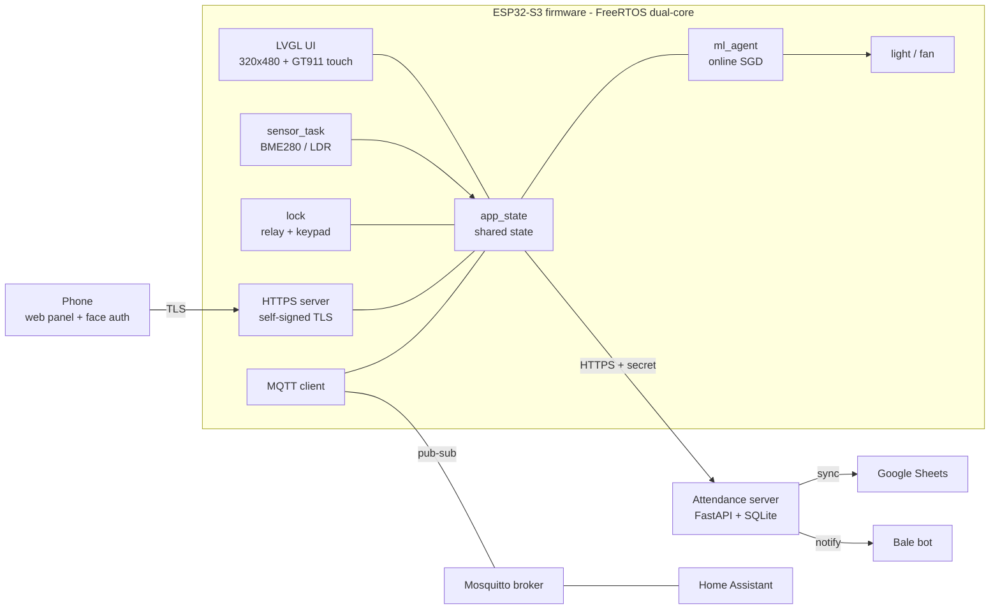
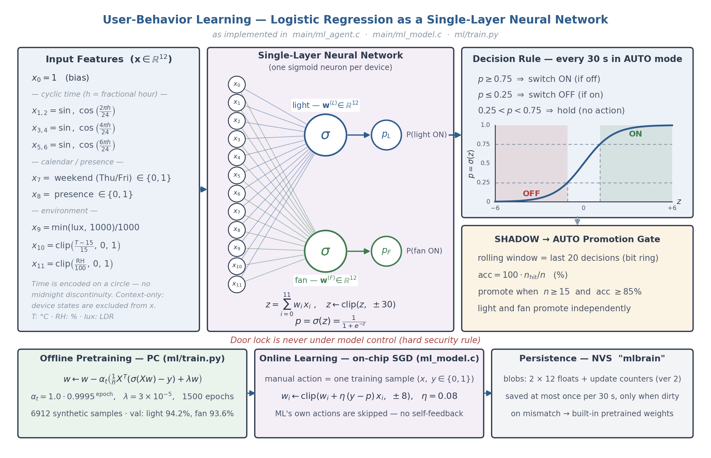
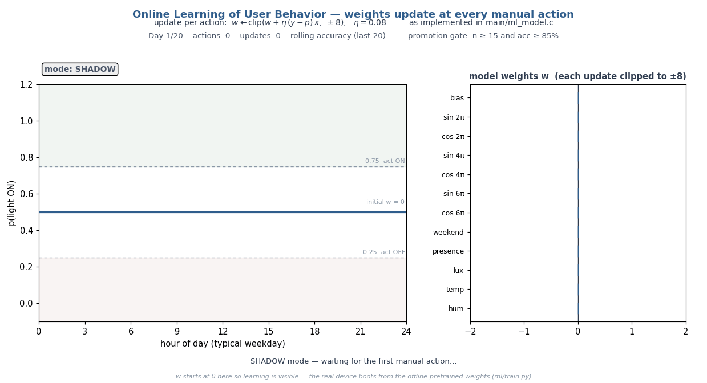
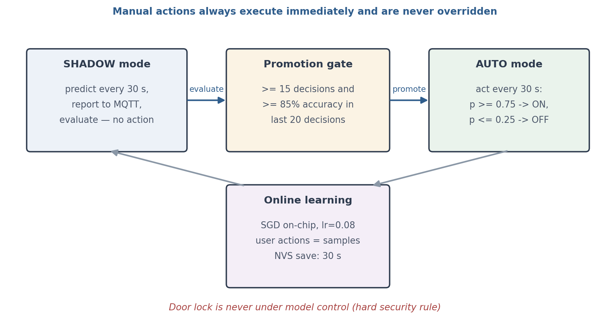
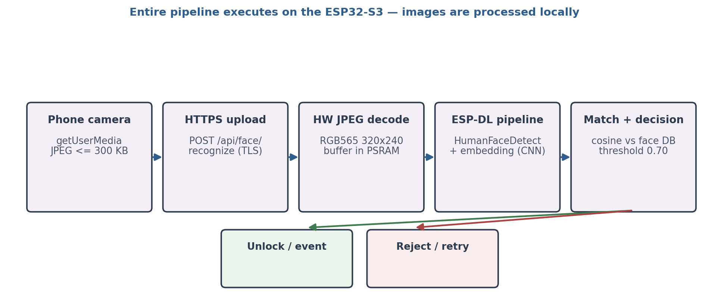
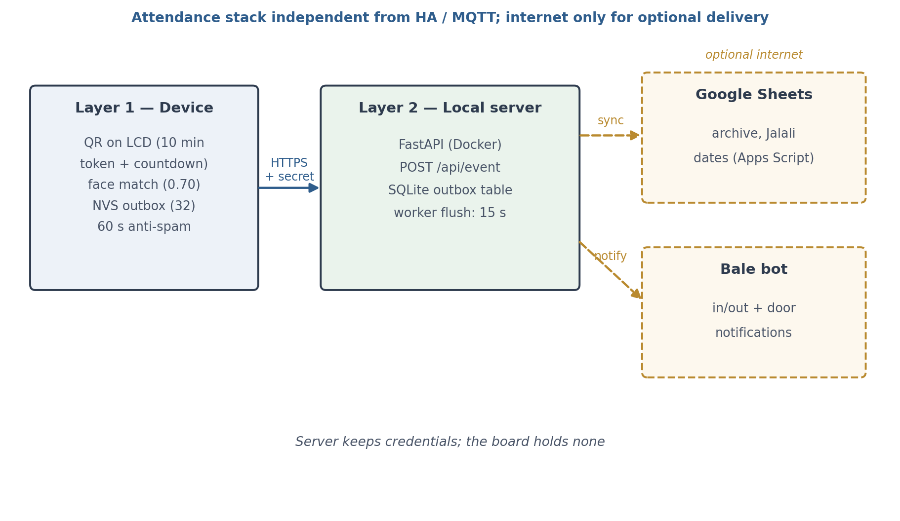
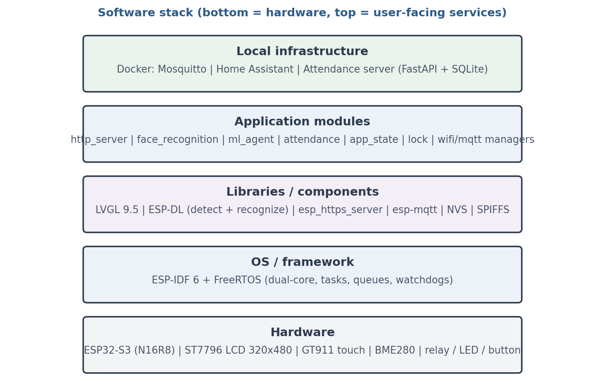

<div align="center">

# 🏠 Smart-Home — Edge-First Home Automation on ESP32-S3

**A self-hosted smart-home platform with on-device face recognition, an on-chip
self-learning behavior agent, and a fully local service stack — no cloud required.**

[](docs/hardware/pin-mapping.md)
[](https://docs.espressif.com/projects/esp-idf/)
[](#)
[](#)
[](#)
[](#)

[](#)
[](#)
[](#)
[](#)
[](#)
[](#)



*All intelligence runs on the edge node — the phone only lends its camera, the servers stay local.*

**[English](README.md)** · [🇮🇷 فارسی](docs/README.fa.md)

</div>

## ✨ Highlights

- 🔓 **Face-recognition door lock on a microcontroller** — the ESP-DL CNN pipeline
  (detect → embed → cosine match) runs entirely on the ESP32-S3; the phone only
  uploads a JPEG over HTTPS and images are processed locally, never stored.
- 🧠 **A behavior agent that learns its user** — two logistic-regression heads
  (light, fan) pre-trained offline to **94.2% / 93.6% validation accuracy**, then
  keep learning **on-chip** with SGD from every manual action you take.
- 🖥️ **A complete touch dashboard** — 320×480 LVGL 9 UI with Wi-Fi setup, MQTT
  provisioning, system settings, attendance and brightness control, right on the device.
- 📅 **Offline-first attendance** — QR token on the LCD, face match by phone camera,
  records queued in an NVS outbox and synced to FastAPI/SQLite, Google Sheets
  (Jalali calendar) and Bale messenger notifications.
- 🏡 **Home Assistant, two-way** — every device state is published over MQTT and
  controllable from HA dashboards and automations; a Bale bot adds remote control
  from chat with 8 commands, event notifications and a security log.
- 🛡️ **Engineered to stay up** — dual I²C buses, a hardware-reset watchdog for the
  touch controller, task watchdogs, network-aware Wi-Fi/MQTT reconnection and
  NVS-persisted state survive outages gracefully.
- 🔒 **Privacy by architecture** — every core service runs on the home LAN; the
  internet is optional and used only for outbound sync and notifications.

## 🏗️ Architecture

The board is the edge node: it owns the UI, the face engine, the ML agent and all
I/O. A Docker home server runs Mosquitto, Home Assistant and the attendance
service. Everything talks over the local Wi-Fi LAN — the cloud is a dashed line.



Runtime data flow between firmware subsystems:



## 🧠 On-Device Machine Learning

A deliberately tiny model with a serious pipeline: 12 context features (cyclic
time-of-day, calendar, presence, lux, temperature, humidity) feed two sigmoid
heads — one per device — pre-trained on a 6,912-sample synthetic dataset, then
refined **on the chip itself**: every manual action becomes a training sample for
online SGD, persisted to NVS at most once every 30 seconds.



| | Light | Fan |
|---|---|---|
| Validation accuracy (offline pre-train) | **94.2%** | **93.6%** |
| Online learning | on-chip SGD (η = 0.08) | on-chip SGD (η = 0.08) |
| Persistence | NVS namespace `mlbrain` | NVS namespace `mlbrain` |

A safety-first lifecycle keeps the agent honest: it starts in **SHADOW** mode
(predicts, reports to MQTT, acts on nothing), and is only promoted to **AUTO**
after a rolling window of ≥ 15 decisions with ≥ 85% accuracy — and manual actions
always win, immediately. **The door lock is never under model control.**

Watch the agent learn from zero — every manual action nudges the weights, the
probability curve takes shape, and once the promotion gate is satisfied the mode
flips to AUTO:



<details>
<summary>🔍 Deep dive: the SHADOW → AUTO promotion gate</summary>
<br>

</details>

## 🔓 Face Recognition & Access Control

The whole pipeline lives on the board: a browser captures the photo, the
hardware JPEG decoder turns it into an RGB565 buffer in PSRAM, and the ESP-DL
CNN produces an embedding that is matched against the on-device face database —
cosine similarity, threshold 0.70, multi-sample enrollment.



- Enroll / edit / delete faces from the device UI or the web dashboard (behind a password)
- QR-tokenized enrollment links that expire in 3 minutes
- Unlock events are logged with their source (face, keypad, web, bot) and pushed as notifications

## 📅 Attendance System

A three-layer, zero-cloud-dependency stack: the LCD shows a rotating QR token
(10-minute validity + countdown), the employee's phone opens a page and matches
the face, and events land on a local FastAPI/SQLite server — which archives them
to Google Sheets with Jalali dates and pings a Bale bot. If the server or the
internet is down, records wait in a 32-slot NVS outbox on the board and flush later.



## 🧱 Tech Stack



## 🔌 Hardware

| Component | Part | Interface |
|---|---|---|
| MCU | ESP32-S3-DevKitC-1 (N16R8 — 16 MB flash, 8 MB octal PSRAM) | — |
| Display | 320×480 TFT (ST7796), 8-bit parallel, PWM backlight | GPIO bus |
| Touch | GT911 capacitive controller | I²C (dedicated bus) |
| Environment | BME280 (temperature / humidity / pressure) + LDR (lux) | I²C / ADC |
| Lock | Relay-driven solenoid lock | GPIO |
| Misc | Status LED, physical button, on-board WS2812 | GPIO |

Full pin map with free/reserved GPIOs: [`docs/hardware/pin-mapping.md`](docs/hardware/pin-mapping.md)

## 📁 Repository Layout

```
Smart-Home/
├── main/                  ESP-IDF firmware (application + display/ UI + certs/)
├── demo/                  PC demo — the real firmware logic & UI on SDL2 virtual hardware
├── server/
│   ├── attendance/        attendance server (FastAPI + SQLite + Sheets + Bale)
│   └── bale_bot/          Bale messenger bot (FastAPI + SQLite)
├── homeassistant/         HA docker-compose drop-in + Mosquitto config
├── ml/                    ML pipeline: synthetic data → training → C weights header
├── tools/                 host-side utilities (serial log peeker, face API test notebook)
├── docs/                  datasheets, pin map, design docs, proposal, Persian README
├── report/                project report (docx/pdf generator + figures)
├── presentation/          defense deck (pptx generator)
├── CMakeLists.txt         ESP-IDF 6.0.2 project
├── partitions.csv         flash partition table
└── sdkconfig.defaults     build defaults
```

## 🚀 Getting Started

**Firmware** (requires [ESP-IDF 6.0.2](https://docs.espressif.com/projects/esp-idf/)):

```bash
git clone https://github.com/MohammadSoroushRabiei/Smart-Home.git
cd Smart-Home
idf.py set-target esp32s3
idf.py build flash monitor
```

**Desktop demo** — the same firmware logic and UI running on SDL2 virtual hardware
(no board needed):

```bash
cmake -S demo -B demo/build && cmake --build demo/build
./demo/build/smartdemo
```

**Services** (Docker, from each service folder):

```bash
cd server/attendance && docker compose up -d --build
cd server/bale_bot    && docker compose up -d --build
```

**ML pipeline** — regenerate and retrain the behavior model:

```bash
python ml/generate_data.py   # 30-day synthetic dataset
python ml/train.py           # writes main/ml_model_weights.h
idf.py build                 # firmware picks up the new weights
```

## 📚 Documentation

- 📄 [Project report (PDF, 53 pages)](report/render/SmartHome-Project-Report.pdf)
- 🔌 [Pin map & free GPIO reference](docs/hardware/pin-mapping.md)
- 🧠 [ML system design](docs/ml-design.md)
- 📅 [Attendance setup guide](docs/attendance/README.md)
- 💬 [Bale bot guide](server/bale_bot/README.md)
- 🇮🇷 [مستندات فارسی / Persian README](docs/README.fa.md)

---

<div align="center">

<br>

**Soroush Rabiei** — Undergraduate Final Project, [Isfahan University of Technology](https://www.iut.ac.ir/)

[](https://github.com/MohammadSoroushRabiei)

</div>
