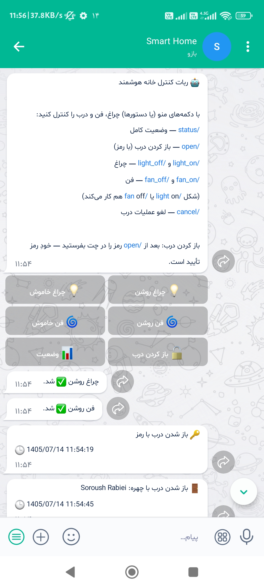
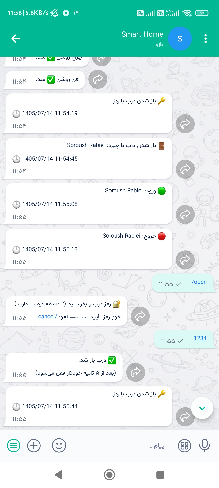
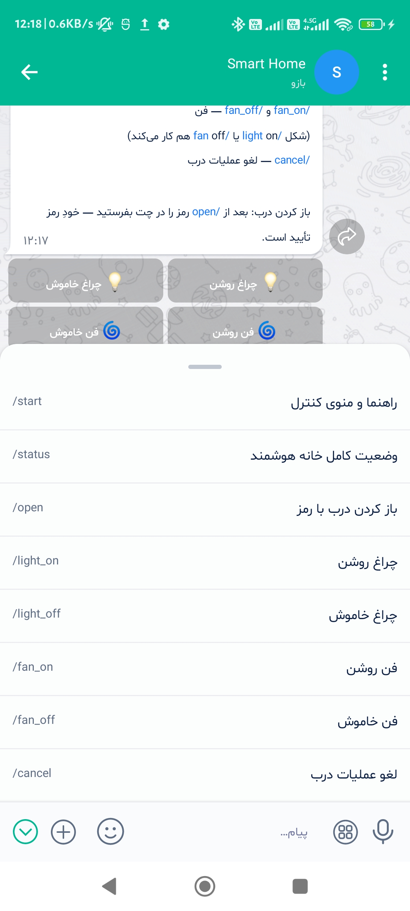
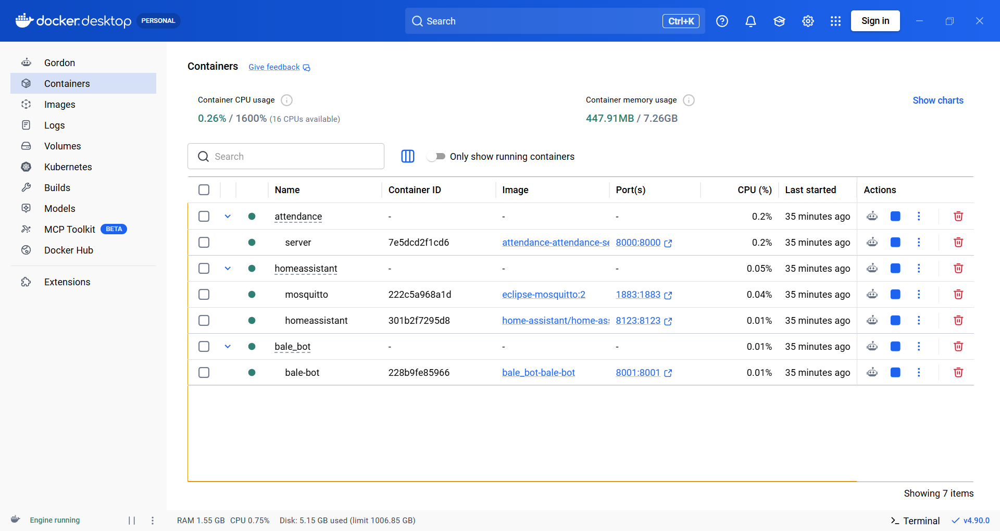
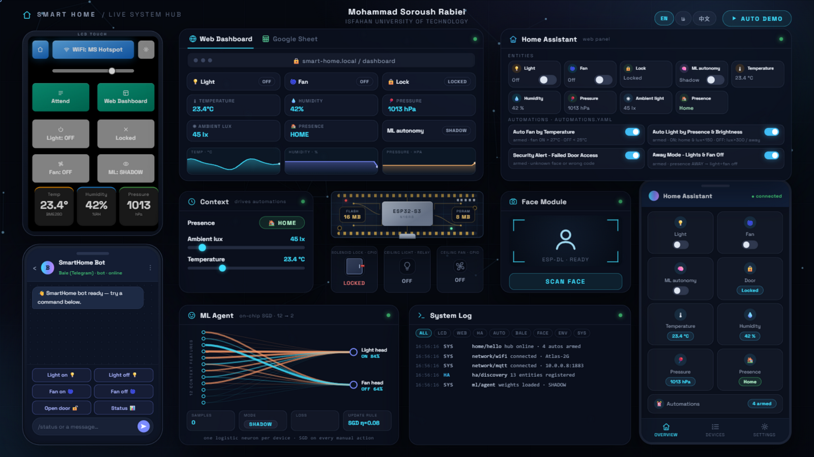
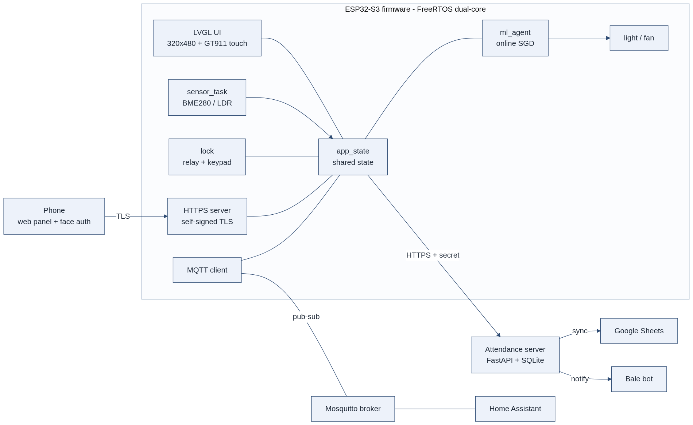

<div align="center">

# 🏠 Smart-Home — Edge-First Home Automation on ESP32-S3

**A self-hosted smart-home platform with on-device face recognition, an on-chip
self-learning behavior agent, and a fully local service stack — no cloud required.**

[](docs/hardware/pin-mapping.md)
[](https://docs.espressif.com/projects/esp-idf/)
[](#)
[](#)
[](#)
[](#)

[](#)
[](#)
[](#)
[](#)
[](#)
[](#)


*The real setup on the bench — the ESP32-S3 edge node with its LVGL dashboard
on the LCD, and the Home Assistant companion app live on the phone.*


*All intelligence runs on the edge node — the phone only lends its camera, the servers stay local.*

**[English](README.md)** · [🇮🇷 فارسی](docs/README.fa.md)

</div>

## ✨ Highlights

- 🔓 **Face-recognition door lock on a microcontroller** — the ESP-DL CNN pipeline
  (detect → embed → cosine match) runs entirely on the ESP32-S3; the phone only
  uploads a JPEG over HTTPS and images are processed locally, never stored.
- 🧠 **A behavior agent that learns its user** — two logistic-regression heads
  (light, fan) pre-trained offline to **94.2% / 93.6% validation accuracy**, then
  keep learning **on-chip** with SGD from every manual action you take.
- 🖥️ **A complete touch dashboard** — 320×480 LVGL 9 UI with Wi-Fi setup, MQTT
  provisioning, system settings, attendance and brightness control, right on the device.
- 📅 **Offline-first attendance** — QR token on the LCD, face match by phone camera,
  records queued in an NVS outbox and synced to FastAPI/SQLite, Google Sheets
  (Jalali calendar) and Bale messenger notifications.
- 🏡 **Home Assistant, two-way** — every device state is published over MQTT and
  controllable from HA dashboards and automations; a Bale bot adds remote control
  from chat with 8 commands, event notifications and a security log.
- 🛡️ **Engineered to stay up** — dual I²C buses, a hardware-reset watchdog for the
  touch controller, task watchdogs, network-aware Wi-Fi/MQTT reconnection and
  NVS-persisted state survive outages gracefully.
- 🔒 **Privacy by architecture** — every core service runs on the home LAN; the
  internet is optional and used only for outbound sync and notifications.

## 📸 Real Hardware & Live Recordings

Nothing staged — everything below is captured from the running system: the
physical board, the real LCD, the deployed containers and the companion apps.
The test recordings play right on this page, served by GitHub's video CDN.

### 🖥️ The On-Device UI, captured from the real LCD

| | | |
|:---:|:---:|:---:|
|  |  |  |
|  |  |  |
|  |  |  |

*Main dashboard · face unlock · Wi-Fi scan & join with the on-screen keyboard ·
MQTT provisioning · settings & passwords · face enrollment · the dual-mode
attendance QR · the QR that opens the web dashboard on any phone.*

*Live test on the real display — touch, unlock, sensors (38 s):*

<div align="center">

<video controls width="360" src="https://github.com/user-attachments/assets/3fca52ed-e168-4575-a4f6-300e99fccbfe"></video>

</div>

### 🌐 Web Dashboard — served by the attendance server

<div align="center">


</div>

Device tiles, door lock (PIN + Face ID), live environment readouts and the ML
agent's SHADOW/AUTO status — served on the LAN; any phone reaches it by
scanning the QR shown on the LCD.

*Dashboard test — toggles, door unlock, live values (43 s):*

<div align="center">

<video controls width="300" src="https://github.com/user-attachments/assets/7c6d9063-2cdd-453c-a8b2-fb2aef746ac0"></video>

</div>

### 🏠 Home Assistant — the companion app on a real phone

<div align="center">


</div>

Environment cards, light / fan / ML-autonomy controls, access status and the
four real automations — every state flows two-way over MQTT.

*Mobile app test — live state & control (58 s):*

<div align="center">

<video controls width="300" src="https://github.com/user-attachments/assets/a053339e-497f-4105-baa8-8d17881ceb84"></video>

</div>

### 🤖 Bale Bot — remote control from chat

| | | |
|:---:|:---:|:---:|
|  |  |  |

*Reply-keyboard control with instant confirmations · door opening via a
2-minute one-time password · the full slash-command menu.*

### 📅 Attendance — end to end

The record lands on the local FastAPI/SQLite server, is archived to Google
Sheets with a Jalali date and entry/exit type, and the Bale bot announces it —
all within seconds.

<div align="center">


</div>

*Face attendance test — QR scan → face match → record + notification (30 s):*

<div align="center">

<video controls width="300" src="https://github.com/user-attachments/assets/4096e28d-9eb9-4661-957a-d4dcb7e40f97"></video>

</div>

### 🐳 The Local Service Stack

<div align="center">



</div>

The whole backend of the platform on one home server: the attendance service,
Mosquitto, Home Assistant and the Bale bot — seven containers at a few hundred
megabytes of RAM.

## 🎬 Interactive Live Hub — the whole system in your browser

[](https://mohammadsoroushrabiei.github.io/Smart-Home/presentation/motion-hub.html)

**[`presentation/motion-hub.html`](presentation/motion-hub.html)** is a self-contained,
zero-dependency replica of the entire running system. Open it in any browser — no build,
no server, no hardware — and every part of the platform comes alive on one screen:

- 🖥️ **The real LCD** — working keypad + face-unlock QR, Wi-Fi scan & join, MQTT
  provisioning, settings (enroll QR, manage faces, door/settings passwords) and the
  dual-mode attendance screen, exactly like the firmware.
- 🌐 **Live web dashboard** — per-device tiles and three live charts; a **Google Sheet**
  tab records every attendance scan (odd scans = entry, even scans = exit).
- 🏠 **Home Assistant** — a web panel with the four real automations from
  `automations.yaml` plus a companion-app view; every state change is two-way.
- 🤖 **Bale bot** — the full command set (`/status`, `/open` with a 2-minute password
  TTL, `/light_on`, `/fan_on`, …) with notifications for door and attendance events.
- 🧠 **The ML agent, live** — the two logistic heads with their trained weights; every
  manual action you click becomes a real on-page SGD training step.
- 🎙️ **A guided auto-demo** — a narrated 12-step spotlight tour of all of the above.
- 🌍 **Trilingual UI** — English · فارسی · 中文, switchable from the pills in the top bar.

**▶ Open it live:** <https://mohammadsoroushrabiei.github.io/Smart-Home/presentation/motion-hub.html>
— or download `presentation/motion-hub.html` and double-click it; everything, including
the fonts, is embedded in that single file.

## 🏗️ Architecture

The board is the edge node: it owns the UI, the face engine, the ML agent and all
I/O. A Docker home server runs Mosquitto, Home Assistant and the attendance
service. Everything talks over the local Wi-Fi LAN — the cloud is a dashed line.


Runtime data flow between firmware subsystems:



## 🧠 On-Device Machine Learning

A deliberately tiny model with a serious pipeline: 12 context features (cyclic
time-of-day, calendar, presence, lux, temperature, humidity) feed two sigmoid
heads — one per device — pre-trained on a 6,912-sample synthetic dataset, then
refined **on the chip itself**: every manual action becomes a training sample for
online SGD, persisted to NVS at most once every 30 seconds.


| | Light | Fan |
|---|---|---|
| Validation accuracy (offline pre-train) | **94.2%** | **93.6%** |
| Online learning | on-chip SGD (η = 0.08) | on-chip SGD (η = 0.08) |
| Persistence | NVS namespace `mlbrain` | NVS namespace `mlbrain` |

A safety-first lifecycle keeps the agent honest: it starts in **SHADOW** mode
(predicts, reports to MQTT, acts on nothing), and is only promoted to **AUTO**
after a rolling window of ≥ 15 decisions with ≥ 85% accuracy — and manual actions
always win, immediately. **The door lock is never under model control.**

Watch the agent learn from zero — every manual action nudges the weights, the
probability curve takes shape, and once the promotion gate is satisfied the mode
flips to AUTO:


<details>
<summary>🔍 Deep dive: the SHADOW → AUTO promotion gate</summary>
<br>

</details>

## 🔓 Face Recognition & Access Control

The whole pipeline lives on the board: a browser captures the photo, the
hardware JPEG decoder turns it into an RGB565 buffer in PSRAM, and the ESP-DL
CNN produces an embedding that is matched against the on-device face database —
cosine similarity, threshold 0.70, multi-sample enrollment.


- Enroll / edit / delete faces from the device UI or the web dashboard (behind a password)
- QR-tokenized enrollment links that expire in 3 minutes
- Unlock events are logged with their source (face, keypad, web, bot) and pushed as notifications

## 📅 Attendance System

A three-layer, zero-cloud-dependency stack: the LCD shows a rotating QR token
(10-minute validity + countdown), the employee's phone opens a page and matches
the face, and events land on a local FastAPI/SQLite server — which archives them
to Google Sheets with Jalali dates and pings a Bale bot. If the server or the
internet is down, records wait in a 32-slot NVS outbox on the board and flush later.


## 🧱 Tech Stack


## 🔌 Hardware

| Component | Part | Interface |
|---|---|---|
| MCU | ESP32-S3-DevKitC-1 (N16R8 — 16 MB flash, 8 MB octal PSRAM) | — |
| Display | 320×480 TFT (ST7796), 8-bit parallel, PWM backlight | GPIO bus |
| Touch | GT911 capacitive controller | I²C (dedicated bus) |
| Environment | BME280 (temperature / humidity / pressure) + LDR (lux) | I²C / ADC |
| Lock | Relay-driven solenoid lock | GPIO |
| Misc | Status LED, physical button, on-board WS2812 | GPIO |

Full pin map with free/reserved GPIOs: [`docs/hardware/pin-mapping.md`](docs/hardware/pin-mapping.md)

## 📁 Repository Layout

```
Smart-Home/
├── main/                  ESP-IDF firmware (application + display/ UI + certs/)
├── demo/                  PC demo — the real firmware logic & UI on SDL2 virtual hardware
├── server/
│   ├── attendance/        attendance server (FastAPI + SQLite + Sheets + Bale)
│   └── bale_bot/          Bale messenger bot (FastAPI + SQLite)
├── homeassistant/         HA docker-compose drop-in + Mosquitto config
├── ml/                    ML pipeline: synthetic data → training → C weights header
├── tools/                 host-side utilities (serial log peeker, face API test notebook)
├── docs/                  datasheets, pin map, design docs, proposal, Persian README
├── report/                project report (docx/pdf generator + figures)
├── presentation/          defense deck (pptx generator)
├── CMakeLists.txt         ESP-IDF 6.0.2 project
├── partitions.csv         flash partition table
└── sdkconfig.defaults     build defaults
```

## 🚀 Getting Started

**Firmware** (requires [ESP-IDF 6.0.2](https://docs.espressif.com/projects/esp-idf/)):

```bash
git clone https://github.com/MohammadSoroushRabiei/Smart-Home.git
cd Smart-Home
idf.py set-target esp32s3
idf.py build flash monitor
```

**Desktop demo** — the same firmware logic and UI running on SDL2 virtual hardware
(no board needed):

```bash
cmake -S demo -B demo/build && cmake --build demo/build
./demo/build/smartdemo
```

**Services** (Docker, from each service folder):

```bash
cd server/attendance && docker compose up -d --build
cd server/bale_bot    && docker compose up -d --build
```

**ML pipeline** — regenerate and retrain the behavior model:

```bash
python ml/generate_data.py   # 30-day synthetic dataset
python ml/train.py           # writes main/ml_model_weights.h
idf.py build                 # firmware picks up the new weights
```

## 📚 Documentation

- 📄 [Project report (PDF, 53 pages)](report/render/SmartHome-Project-Report.pdf)
- 🔌 [Pin map & free GPIO reference](docs/hardware/pin-mapping.md)
- 🧠 [ML system design](docs/ml-design.md)
- 📅 [Attendance setup guide](docs/attendance/README.md)
- 💬 [Bale bot guide](server/bale_bot/README.md)
- 🇮🇷 [مستندات فارسی / Persian README](docs/README.fa.md)

---

## License

This project is proprietary — **all rights reserved**. See [LICENSE](LICENSE).
Reuse, redistribution, or derivative work is not permitted without written permission.
For inquiries: mohammadsoroushrabiei@gmail.com

<div align="center">

<br>

**Mohammad Soroush Rabiei** — Undergraduate Final Project, [Isfahan University of Technology](https://www.iut.ac.ir/)

[](https://github.com/MohammadSoroushRabiei)

</div>
